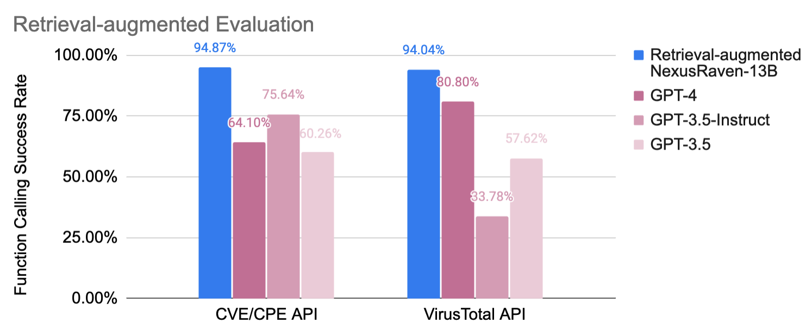
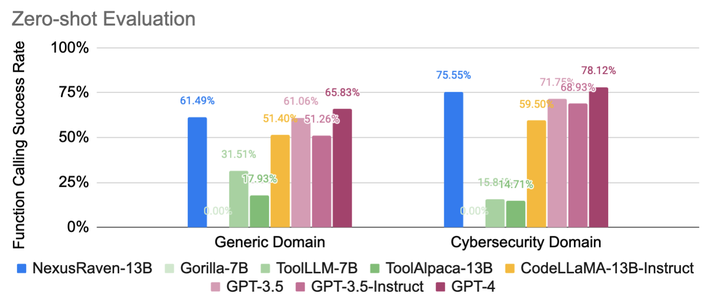

# NexusRaven: Surpassing the state-of-the-art in open-source function calling LLMs 

[](CODE_LICENSE)
[](DATA_LICENSE)
[](https://www.python.org/downloads/release/python-3100/)

<p align="center">
<a href="https://huggingface.co/Nexusflow" target="_blank">Nexusflow HF</a> - <a href="http://nexusflow.ai/blog" target="_blank">NexusRaven blog post</a> - <a href="https://huggingface.co/Nexusflow/NexusRaven-13B" target="_blank">NexusRaven-13B</a> - <a href="https://huggingface.co/datasets/Nexusflow/NexusRaven_API_evaluation" target="_blank">NexusRaven API evaluation dataset</a> - <a href="https://www.linkedin.com/feed/update/urn:li:activity:7113263527909330945/" target="_blank">NexusRaven LinkedIn Post</a> - <a href="https://x.com/NexusflowX/status/1707470614012035561?s=20" target="_blank">NexusRaven Twitter Thread</a>
</p>

<p align="center" width="100%">
<a></a>
</p>


Welcome to the NexusRaven API repository! The primary purpose of this repository is to serve as an evaluation framework for the NexusRaven workflow and to enable accessible reproduction of our results. We hope that the contents of this repository are of value to you and your team! 


Table of contents
- [NexusRaven: Surpassing the state-of-the-art in open-source function calling LLMs](#nexusraven-surpassing-the-state-of-the-art-in-open-source-function-calling-llms)
  - [Introducing NexusRaven-13B](#introducing-nexusraven-13b)
  - [Setup](#setup)
  - [NexusRaven model usage](#nexusraven-model-usage)
  - [Evaluation dataset curation](#evaluation-dataset-curation)
    - [API evaluation dataset standardization](#api-evaluation-dataset-standardization)
    - [Running ToolLLM model evaluation](#running-toolllm-model-evaluation)
  - [Evaluation](#evaluation)
    - [NexusRaven](#nexusraven)
    - [GPT-3.5](#gpt-35)
    - [GPT-3.5 Instruct](#gpt-35-instruct)
    - [GPT-4](#gpt-4)
    - [ToolLLM](#toolllm)
    - [ToolAlpaca](#toolalpaca)
    - [CodeLlama 13B Instruct](#codellama-13b-instruct)
  - [Future releases](#future-releases)
  - [NexusRaven model limitations](#nexusraven-model-limitations)
  - [License](#license)
  - [References](#references)
  - [Citation](#citation)
  - [Contact](#contact)


## Introducing NexusRaven-13B
NexusRaven is an open-source and commercially viable function calling LLM that surpasses the state-of-the-art in function calling capabilities. 

📊 Performance Highlights: With our demonstration retrieval system, NexusRaven-13B achieves a 95% success rate in using cybersecurity tools such as CVE/CPE Search and VirusTotal, while prompting GPT-4 achieves 64%. It has significantly lower cost and faster inference speed compared to GPT-4.

🔧 Generalization to the Unseen: NexusRaven-13B generalizes to tools never seen during model training, achieving a success rate comparable with GPT-3.5 in zero-shot setting, significantly outperforming all other open-source LLMs of similar sizes. 

🔥 Commercially Permissive: The training of NexusRaven-13B does not involve any data generated by proprietary LLMs such as GPT-4. You have full control of the model when deployed in commercial applications.

<p align="center" width="100%">
<a></a>
<a></a>
</p>


## Setup
```bash
git clone https://github.com/nexusflowai/NexusRaven
pip install -e .
```

## NexusRaven model usage
NexusRaven accepts a list of python functions. These python functions can do anything (including sending GET/POST requests to external APIs!). The two requirements include the python function signature and the appropriate docstring to generate the function call. 

NexusRaven is highly compatible with langchain. See [scripts/langchain_example.py](scripts/langchain_example.py). An example without langchain can be found in [scripts/non_langchain_example.py](scripts/non_langchain_example.py)

Please note that the model will reflect on the answer sometimes, so we highly recommend stopping the model generation at a stopping criteria of `["\nReflection:"]`, to avoid spending unnecessary tokens during inference, but the reflection might help in some rare cases. This is reflected in our langchain example. 

The "Initial Answer" can be executed to run the function.


## Evaluation dataset curation
The instructions below can be used to reproduce our evaluation set, found at
NexusRaven_API_evaluation [dataset](https://huggingface.co/datasets/Nexusflow/NexusRaven_API_evaluation), [dataset schema](https://huggingface.co/datasets/Nexusflow/NexusRaven_API_evaluation/blob/main/README.md). 

### API evaluation dataset standardization
```bash
# Upload raw queries
python raven/data/upload_raw_queries.py \
    --hf_path {your hf path} \
    --subset raw_queries

# Upload standardized api list
python raven/data/upload_standardized_api_list.py \
    --hf_path {your hf path} \
    --subset standardized_api_list

# Upload standardized queries
python raven/data/upload_standardized_queries.py \
    --hf_path {your hf path} \
    --standardized_queries_subset standardized_queries \
    --raw_queries_subset raw_queries \
    --standardized_api_list_subset standardized_api_list
```

### Running ToolLLM model evaluation
Getting generation responses from the ToolLLM model using this code requires access to a single GPU. We ran ours on a 40GB A100 GPU. 

```bash
# Upload queries and api list in ToolLLM format
python raven/data/upload_queries_in_toolllm_format.py \
    --hf_path {your hf path} \
    --toolllm_queries_subset queries_in_toolllm_format \
    --toolllm_api_list_subset api_list_in_toolllm_format \
    --standardized_queries_subset standardized_queries \
    --standardized_api_list_subset standardized_api_list

# Run ToolLLM evaluations
python raven/eval/run_toolllm.py \
    --hf_path {your hf path} \
    --toolllm_queries_subset queries_in_toolllm_format \
    --toolllm_api_list_subset api_list_in_toolllm_format \
    --toolllm_outputs_subset outputs_in_toolllm_format
```


## Evaluation
Results can be reproduced using the following instructions. The NexusRaven and CodeLlama 13B Instruct evaluations require access to a Huggingface Inference Endpoint. GPT-3.5, GPT-3.5 Instruct, and GPT-4 require an OpenAI API key. 

NexusRaven is especially capable at *single-turn zero-shot* function calling capability. Thus, we evaluate all models using this paradigm. Some of the models below like ToolLLM and ToolAlpaca leverage multiturn reactions to generate better function calling outputs. In practice, the react approach is expensive in terms of both time and money, especially in production driven environments when lower latency is critical. 

We provide evaluation data and infrastructure for 5 datasets:
- `cve_cpe`
- `emailrep`
- `virustotal`
- `toolalpaca`
- `toolllm`*

*The ToolLLM evaluation dataset originally contains no ground truths. As a result, we have done our best to curate, filtere, and post-process the ToolLLM evaluation dataset to a higher quality. Unfortunately, the resulting dataset only consists of 21 samples. When benchmarking, we have seen up to 1 sample accuracy differences across runs due to the non-deterministic nature of how these models are served. This translates to a swing in accuracy around 5%. In the future, we are looking to improve the quality of this dataset or use a higher quality generic-domain function calling evaluation dataset! 


### NexusRaven
1. Create a HF inference endpoint using https://huggingface.co/Nexusflow/NexusRaven-13B
   1. We ran ours on a `GPU xlarge` node consisting of 1x A100 40GB GPU
   2. Under `Advanced configuration`:
      1. We use no quantization in the TGI endpoint (only using the HF default torch.bfloat16)
      2. `Max Input Length` is set to 8192, `Max Number of Tokens` to 8193, and `Max Batch Prefill Tokens` to 8192
2. Copy the inference endpoint url and use it here
3. Make the inference endpoint public (LangChain currently does not support private inference endpoints)

```bash
./scripts/evaluate_nexusraven.sh emailrep {inference endpoint url}
./scripts/evaluate_nexusraven.sh {dataset name} {inference endpoint url}
```

### GPT-3.5
```bash
./scripts/evaluate_gpt3_5.sh emailrep
./scripts/evaluate_gpt3_5.sh {dataset name}
```

### GPT-3.5 Instruct
```bash
./scripts/evaluate_gpt3_5_instruct.sh emailrep
./scripts/evaluate_gpt3_5_instruct.sh {dataset name}
```

### GPT-4
```bash
./scripts/evaluate_gpt4.sh emailrep
./scripts/evaluate_gpt4.sh {dataset name}
```

### ToolLLM
```bash
./scripts/evaluate_toolllm.sh emailrep
./scripts/evaluate_toolllm.sh {dataset name}
```

### ToolAlpaca
```bash
./scripts/evaluate_toolalpaca.sh emailrep
./scripts/evaluate_toolalpaca.sh {dataset name}
```

### CodeLlama 13B Instruct
1. Create a HF inference endpoint using https://huggingface.co/codellama/CodeLlama-13b-Instruct-hf
   1. We ran ours on a `GPU xlarge` node consisting of 1x A100 40GB GPU
   2. Under `Advanced configuration`:
      1. We use no quantization in the TGI endpoint (only using the HF default torch.bfloat16)
      2. `Max Input Length` is set to 8192, `Max Number of Tokens` to 8193, and `Max Batch Prefill Tokens` to 8192
2. Copy the inference endpoint url and use it here
3. Make the inference endpoint public (LangChain currently does not support private inference endpoints)

```bash
./scripts/evaluate_codellamainstruct.sh emailrep {inference endpoint url}
./scripts/evaluate_codellamainstruct.sh {dataset name} {inference endpoint url}
```


## Future releases
1. End-to-end code to replicate our ToolAlpaca model evaluations. The code mapping our standardized API format into a form usable by the ToolAlpaca repo is not ready for release. In addition, the ToolAlpaca repo required several changes in order to run properly. 
2. Code transforming ToolAlpaca and ToolLLM evaluation data into its current forms (pre-standardization of this repo). There are several design choices that we made in order to do our due diligence in ensuring the highest quality evaluation dataset. Our efforts are imperfect and we are more than happy to iterate on these datasets!


## NexusRaven model limitations
1. We highly recommend using a stop criteria of `["\nReflection:"]`. The model was trained to first generate an answer and then reflect on its answer to either improve the answer or keep the answer the same. However, this "chain of thought" is often not helpful, and the final answer is seldom better than the initial call. Therefore, we strongly recommend using the Initial Call as the main call to execute. 
2. The model works best when it is connected with a retriever when there are a multitude of functions, as a large number of functions will saturate the context window of this model. 
3. The model can be prone to generate incorrect calls. Please ensure proper guardrails to capture errant behavior is in place. 


## License
The code in this repository for running the NexusRaven model, the evaluation framework, and the data processing code are licensed under [Apache 2.0](CODE_LICENSE). 

The evaluation data in this repository consists primarily of our own curated evaluation data that only uses open source commercializable models. However, we include general domain data from the ToolLLM and ToolAlpaca papers. Since the data in the ToolLLM and ToolAlpaca works use OpenAI's GPT models for the generated content, the data is not commercially licensable, even if our own data is. As a result, the evaluation data used here is strictly non-commercial under [CC-BY-NC-4.0](DATA_LICENSE). See https://creativecommons.org/licenses/by-nc/4.0/ for more details about CC-BY-NC-4.0. Thank you for understanding!


## References
We thank the following authors and entities for their models and evaluation data, which we leveraged to produce the results contained in this repository. Their citations can be found below

1. OpenAI GPT
2. CodeLlama team
3. ToolAlpaca team
4. ToolLLM team

```
@misc{rozière2023code,
      title={Code Llama: Open Foundation Models for Code}, 
      author={Baptiste Rozière and Jonas Gehring and Fabian Gloeckle and Sten Sootla and Itai Gat and Xiaoqing Ellen Tan and Yossi Adi and Jingyu Liu and Tal Remez and Jérémy Rapin and Artyom Kozhevnikov and Ivan Evtimov and Joanna Bitton and Manish Bhatt and Cristian Canton Ferrer and Aaron Grattafiori and Wenhan Xiong and Alexandre Défossez and Jade Copet and Faisal Azhar and Hugo Touvron and Louis Martin and Nicolas Usunier and Thomas Scialom and Gabriel Synnaeve},
      year={2023},
      eprint={2308.12950},
      archivePrefix={arXiv},
      primaryClass={cs.CL}
}

@misc{tang2023toolalpaca,
      title={ToolAlpaca: Generalized Tool Learning for Language Models with 3000 Simulated Cases}, 
      author={Qiaoyu Tang and Ziliang Deng and Hongyu Lin and Xianpei Han and Qiao Liang and Boxi Cao and Le Sun},
      year={2023},
      eprint={2306.05301},
      archivePrefix={arXiv},
      primaryClass={cs.CL}
}

@misc{qin2023toolllm,
      title={ToolLLM: Facilitating Large Language Models to Master 16000+ Real-world APIs}, 
      author={Yujia Qin and Shihao Liang and Yining Ye and Kunlun Zhu and Lan Yan and Yaxi Lu and Yankai Lin and Xin Cong and Xiangru Tang and Bill Qian and Sihan Zhao and Runchu Tian and Ruobing Xie and Jie Zhou and Mark Gerstein and Dahai Li and Zhiyuan Liu and Maosong Sun},
      year={2023},
      eprint={2307.16789},
      archivePrefix={arXiv},
      primaryClass={cs.AI}
}
```


## Citation
```
@misc{nexusraven,
      title={NexusRaven: Surpassing the state-of-the-art in open-source function calling LLMs}, 
      author={Nexusflow.ai team},
      year={2023},
      url={http://nexusflow.ai/blog}
}
```

## Contact
Please reach out to info@nexusflow.ai for any questions!
